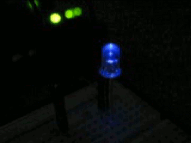

# 💡 LED Control Library


---

## 🎬 Demonstração

<p align="center">
  
</p>

---

## 📖 Sobre

Uma biblioteca simples, leve e eficiente para controle de LEDs em sistemas embarcados.

---

## ✨ Funcionalidades

- 🔛 Ligar LED  
- 🔘 Desligar LED  
- 🔄 Alternar estado  
- ✨ Piscar LED  
- 📊 Consultar estado  

---

## ⚙️ API

### 🔛 `led_ligar()`
```c
led_ligar();
led_desligar();
led_alternar();
led_piscar(5, 500);
if (led_estado()) {
    // LED ligado
}

📁 led-library
 ├── led.h
 ├── led.c
 ├── README.md
 └── assets/
     └── demo.gif


